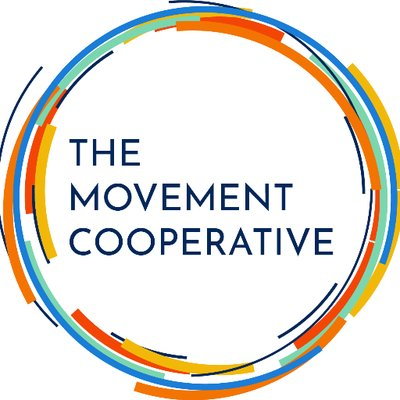
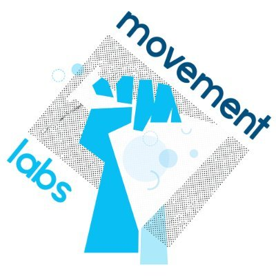
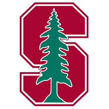

## The Movement Cooperative
- *Associate Engineering Manager* | March 2023 - Present
- 
- Tags: Engineering
- Badges:
- List Items:
  - Design and implement member-facing infrastructure, including automated data catalog and pipeline monitoring reports.
  - Manage day-to-day operations of the engineering team including biweekly sprints, quarterly OKR planning, vendor communications, and development of early-career team members.
  - Maintain legacy software systems, including AWS Terraform project and several high-traffic web applications (Node, Flask, React).

## The Movement Cooperative 
- *Data Engineer* | March 2023 - March 2024
- 
- Tags: Engineering
- Badges:
- List Items:
  - Led warehouse migration from Redshift to BigQuery, refactoring thousands of line of bespoke ETL code into reusable operators in the process.
  - Thought leader in organization's adoption of modern software tools - e.g., dbt for pattern-based data models, Docker for containerized development.
  - Contributer to Parsons, a Python library of integrations for the progressive community.

## Movement Labs 
- *Software Engineer* | June 2022 - March 2023
- 
- Tags: Engineering
- Badges:
- List Items:
  - Developed and managed all software development operations to accelerate technical work and get productivity tools in the hands of stakeholders across multiple programs.
  - Built out suite of custom monitoring and efficiency automations including automated Google Sheets reports of SMS campaign results and site reliability alerts delivered via Slack webhooks.

## Stanford Social Neuroscience Lab
- *Lab Manager + Research Engineer* | June 2020 - September 2022
- 
- Tags: 
  - Research
  - Engineering
- Badges:
- List Items:
  - Managed day-to-day operations in the lab, including hiring and financial functions.
  - Principal in-house engineer tasked with developing software systems to enable scalable research programs, as well as daily tasks in the lab.