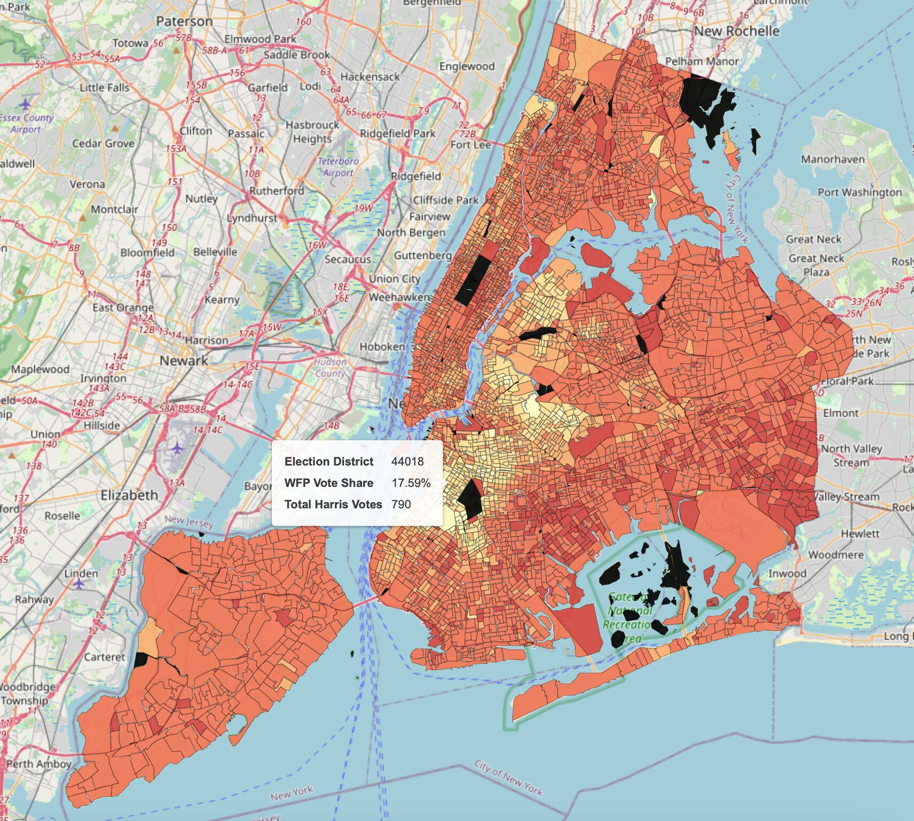
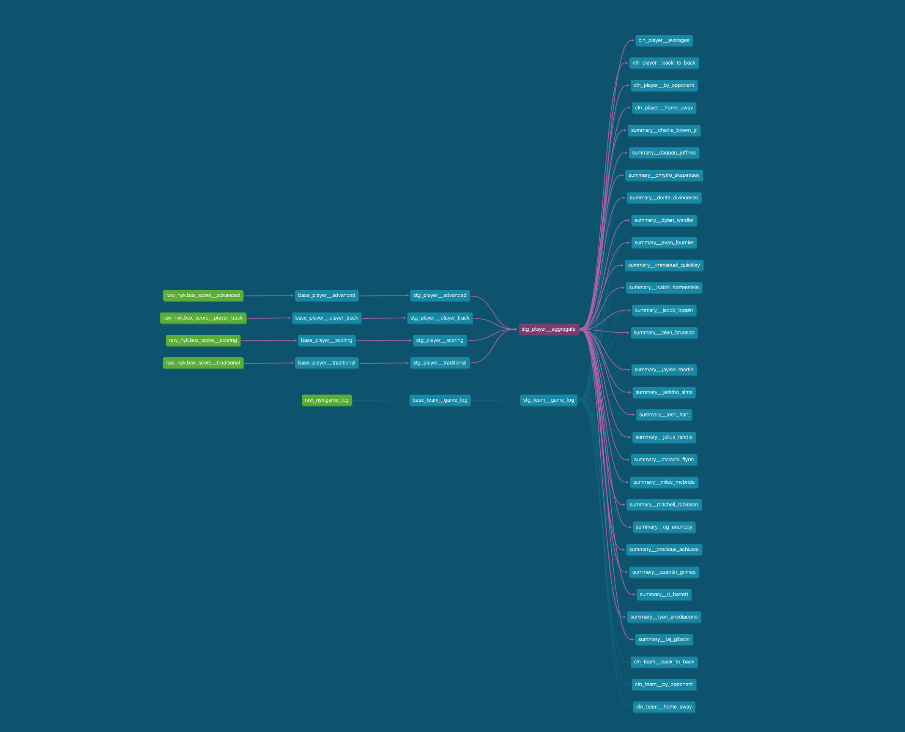
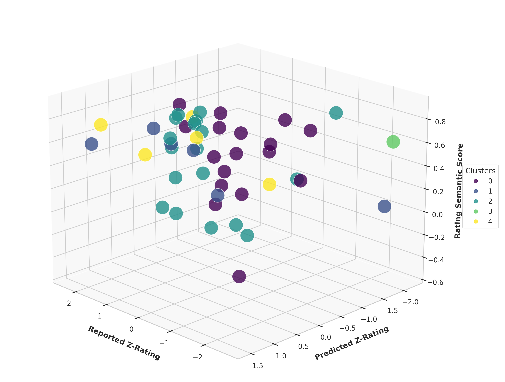

## WFP 🤝 NYC
I analyzed the percentage of Kamala Harris votes that were cast on the Working Families Party line in New York City. Results were presented in a Folium choropleth map and hosted in a Flask application via Google Cloud Run.
- 
- Tags: Category 1
- Badges:
- Buttons:
  - Source Code [https://github.com/IanRFerguson/wfp-nyc]
  - See the App [https://wfp-nyc-817201868807.us-central1.run.app]

## NBA Player Analytics
Using Prefect as an orchestration tool, this project extracts data from the NBA API, loads it into BigQuery, and models it with dbt to extract valuable game-over-game metrics and player-specific performance summaries.
- 
- Tags: Category 1
- Badges:
- Buttons:
  - Source Code [https://github.com/IanRFerguson/player-analytics]

## Predicting Whiskey Ratings
This is an end-to-end Machine Learning pipeline designed to predict my ratings of different whiskeys from around the world. The ML models are integrated with dbt so that all the transformations and predictions occur seamlessly in one project.
- 
- Tags: Category 1
- Badges:
- Buttons:
  - Source Code [https://github.com/IanRFerguson/whiskey-ml]