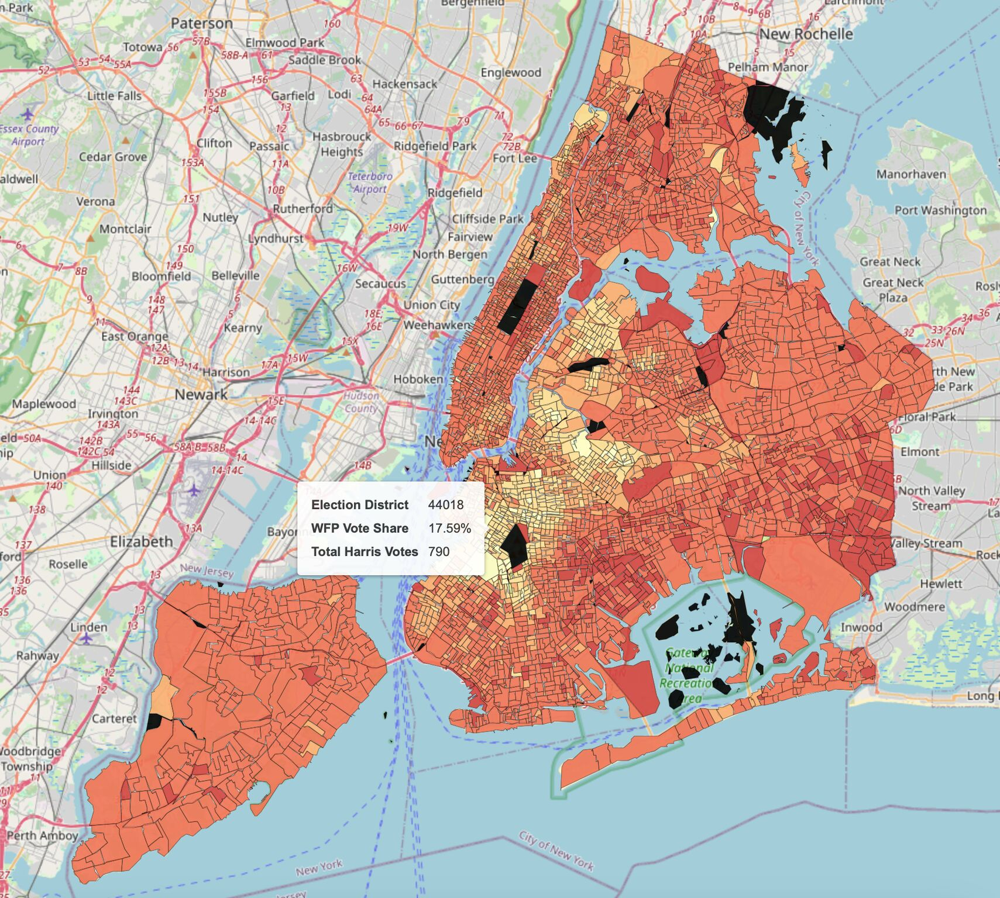
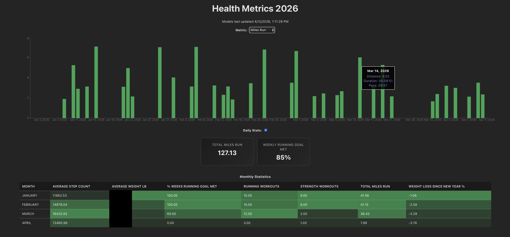
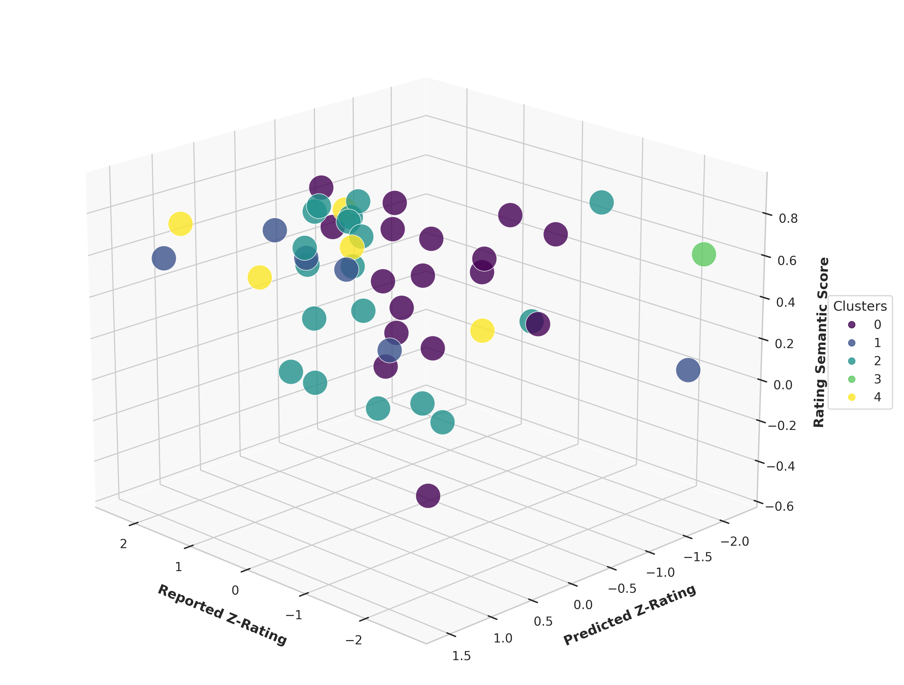
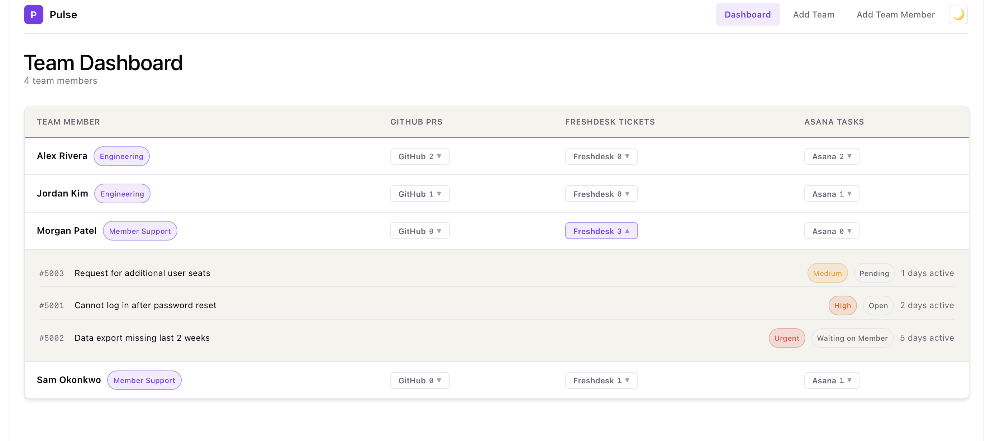

## WFP 🤝 NYC
Using publicly available election data, I built an interactive Choropleth map to display the percentage of votes that Kamala Harris earned on the Working Families Party line in New York City. Flask serves the map, and Google Cloud Run hosts the web application in the cloud.
- 
- Tags: Category 1
- Badges:
- Buttons:
  - Source Code [https://github.com/IanRFerguson/wfp-nyc]
  - See the App [https://wfp-nyc-817201868807.us-central1.run.app]

## Health Metrics
In an effort to lose a few pounds and keep my exercise consistent, I built an analytics dashboard to track my running mileage, strength training, weight, and diet. Every Sunday, I read the week's data into Python and have Gemini annotate my progress and offer comparisons to earlier weeks; the resulting analysis is formatted in an email and distributed via Resend server.
- 
- Tags: Category 1
- Badges:
- Buttons:
  - Source Code [https://github.com/IanRFerguson/pulse]
  

## Predicting Whiskey Ratings
Built off of a single Google Sheet, this project models my preferences in whiskey based on a number of dimensions (style, ABV, flavor notes, etc). The raw input is fed into BigQuery, where dbt transforms and standardizes it before passing it off to Google Dataproc to run Spark MLlib predictive models.
- 
- Tags: Category 1
- Badges:
- Buttons:
  - Source Code [https://github.com/IanRFerguson/whiskey-ml]

## Pulse
Pulse is an Engineering Manager's productivity portal. It syncs data across Github, Asana, and Freshdesk to offer a single pane of Individual Contributor capacity. Data is loaded with dlt, transformed with dbt, and served in a React/TypeScript frontend via Flask API.
- 
- Tags: Category 1
- Badges:
- Buttons:
  - Source Code [https://github.com/IanRFerguson/pulse]
